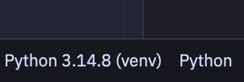
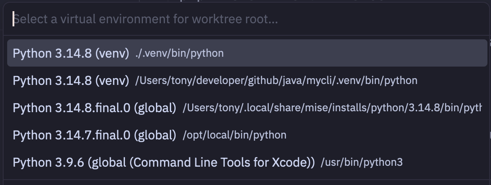

< [back](../README.md)

# MyCLI

## How to intall run and build

```shell
mise install

mise exec -- python --version
mise exec -- pipx --version

python -m venv .venv

source .venv/bin/activate

# for development (editors & ide)
pip install -e . --force

# to install mycli to be globally available command with isolated and ephemeral virtual environment
pipx install -e . --force

# configure the zsh completion
echo 'eval "$(_MYCLI_COMPLETE=zsh_source mycli)"' >> ~/.zshrc
```

## Start from scratch (purge the caches)

Handy when you change the pins in `pyproject.toml` or `mise.toml` often and suspect a stale cache.

```shell
# inspect before purging
python -m pip cache info
pipx cache dir
pipx list

# purge: pip (downloaded wheels + http index) and pipx (cached run environments)
python -m pip cache purge
pipx cache purge

# drop the stale build artifacts of the project
rm -rf build dist *.egg-info

# remove the previously installed console command
pipx uninstall mycli
pipx list                       # confirm mycli is gone

# rebuild the development environment
python -m venv .venv
source .venv/bin/activate
pip install --no-cache-dir -e ".[dev]"

# reinstall globally, re-resolving the pinned dependencies
pipx install --force --pip-args="--no-cache-dir" -e .

# verify
pipx list
pipx runpip mycli list | grep -E 'click|requests'
```

`--force` is what actually re-resolves the dependencies; a plain `pipx reinstall` reuses the recorded spec and ignores your edits. In a shell that is not mise-activated, prefix every command with `mise exec --`.

## Usage

```shell
mycli users add --name Bob --age 30 --gender male
```

Without activating `.venv`, call the console script of the venv or the module entry point:

```shell
.venv/bin/mycli users add --name Bob --age 30 --gender male
python -m mycli.cli users add --name Bob --age 30 --gender male
```

If `mycli` is not on your `PATH`, run the entry point directly from the repo root:

```shell
python mycli/cli.py users add --name Bob --age 30 --gender male
```

## Notes

- common editors / IDEs offers the support for python virtual envs (.venv)

This is how it looks in the Zed editor when python language support is triggered (a python file is opened)

Status bar



And this is how it looks when by clicking on the status bar button the first suggestion is the best one (.venv)



There are similar suggestions for other editors and IDEs such as VSCode, PyCharm, IntelliJ.

### Where `mycli` lives and how the system finds it

`pip` and `pipx` hold two independent copies of the dependencies:

```shell
# pip, inside the activated .venv — local to the project
mycli/.venv/lib/python3.14/site-packages/                    # click, requests, dev extras
mycli/.venv/bin/mycli                                        # console script

# pipx, behind the global command — shared store
$HOME/Library/Application Support/pipx/venvs/mycli/lib/python3.14/site-packages/   # click, requests
$HOME/.local/bin/mycli -> .../pipx/venvs/mycli/bin/mycli    # symlink, this is what $PATH resolves
```

So the bare `mycli` command runs the pipx venv interpreter and never sees `.venv` (and vice versa). Both are editable installs of this repo: code edits are live in each, but a `pyproject.toml` change needs a reinstall per environment. The store path contains a space, so quote it.

```shell
python -c "import click; print(click.__file__)"      # where the venv imports it from
pipx runpip mycli show click | grep Location          # where the pipx venv imports it from
```
